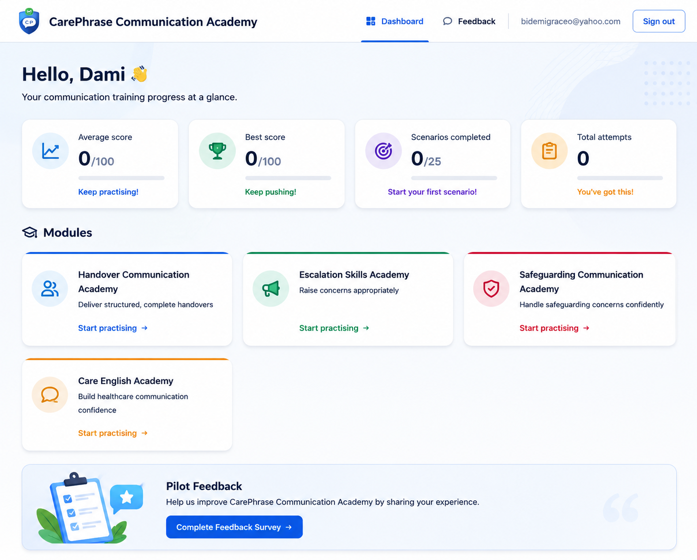

# CarePhrase Communication Academy

AI-powered communication training platform that helps UK health and social care professionals practise structured handovers, escalation, safeguarding communication, and workplace English using realistic AI feedback.


🌐 **Live Demo:** https://comms.carephrase.com  
🏢 **Portfolio:** https://daramolajo.co.uk

## Highlights

- 🎙️ Voice-based communication practice
- 🤖 AI-powered personalised feedback
- 📊 Learner progress dashboard
- 🛡️ Safeguarding communication scenarios
- 📞 Escalation and handover practice
- 📱 Mobile-friendly interface



---

> **CarePhrase Communication Academy dashboard** – AI-powered communication training platform for UK health and social care professionals. Learners practise structured handovers, escalation, safeguarding communication, and UK care English while tracking their progress through an interactive dashboard.

AI-powered communication training platform for UK health and social care staff. Learners practise real workplace communication scenarios by voice and receive structured, scored feedback.

> **Training tool only.** CarePhrase does not provide clinical advice, replace professional judgement, or generate official care records, and it is not a medical device.

This repository is the **MVP (Version 1)** foundation.

## 🌐 Live Demo

**Application:** [https://comms.carephrase.com](https://comms.carephrase.com)

### Purpose

CarePhrase Communication Academy helps UK health and social care professionals improve workplace communication through realistic, AI-assisted practice scenarios.

Learners receive structured feedback on clarity, completeness, professional language, safety awareness, and communication quality to support continuous learning.

## What's built

This is a **foundation-first** build (per the developer brief):

- ✅ Next.js (App Router) + React + Tailwind CSS scaffold
- ✅ Supabase email/password authentication + route protection (middleware)
- ✅ Postgres data model (`profiles`, `attempts`) with row-level security
- ✅ **Module 1 — Handover Communication Academy**, fully working end-to-end:
  - Three scenarios (end-of-shift handover, resident deterioration, medication concern)
  - In-browser voice recording (MediaRecorder API, works on mobile + desktop)
  - Whisper transcription + GPT-4o feedback via OpenAI
  - Structured scorecard (clarity, completeness, professional language, safety awareness, structure) + learning tips
  - Compliance disclaimer on every feedback screen
- ✅ Learner dashboard (average/best score, scenarios completed, recent attempts, AI recommendations)
- ✅ **Mock mode** — runs end-to-end with simulated transcription + feedback when no OpenAI key is set
- 🔜 Module 2 (Escalation) and Module 3 (Care English) are scaffolded as "coming soon" cards and ready to expand using the same pattern.

## Tech stack

| Layer | Technology |
| --- | --- |
| Frontend | Next.js 15, React 19, Tailwind CSS |
| Backend | Next.js Route Handlers (Node.js runtime) |
| Database & Auth | Supabase (Postgres) |
| AI | OpenAI GPT-4o |
| Speech-to-text | OpenAI Whisper |
| Hosting | Vercel |

## Getting started

### 1. Install dependencies

```bash
npm install
```

### 2. Configure environment

```bash
cp .env.example .env.local
```

- **Supabase**: create a project at [supabase.com](https://supabase.com), then copy the Project URL and anon key (Project Settings → API) into `NEXT_PUBLIC_SUPABASE_URL` and `NEXT_PUBLIC_SUPABASE_ANON_KEY`.
- **OpenAI**: leave `OPENAI_API_KEY` blank to run in **mock mode**, or paste a key to enable real Whisper + GPT-4o.

### 3. Set up the database

In the Supabase dashboard, open the **SQL editor** and run the contents of [`supabase/schema.sql`](supabase/schema.sql). This creates the `profiles` and `attempts` tables, row-level security policies, and the trigger that creates a profile on sign-up.

> Tip: in Supabase **Authentication → Providers → Email**, you can turn off "Confirm email" during local testing so new accounts can sign in immediately.

### 4. Run the app

```bash
npm run dev
```

Open [http://localhost:3000](http://localhost:3000), sign up, and try the Handover module.

## Project structure

```
src/
  app/
    page.tsx                      # Landing page
    login/ , signup/              # Auth pages
    dashboard/                    # Learner dashboard
    modules/[moduleId]/           # Scenario list per module
    modules/[moduleId]/[scenarioId]/   # Practice + feedback flow
    api/transcribe/               # Whisper transcription endpoint
    api/feedback/                 # GPT-4o feedback + attempt persistence
  components/                     # VoiceRecorder, FeedbackCard, Scorecard, etc.
  lib/
    openai.ts                     # AI calls + mock fallback + prompt design
    scenarios.ts                  # Module + scenario definitions
    supabase/                     # Browser/server/middleware clients
    types.ts                      # Shared domain types
supabase/schema.sql               # Database schema + RLS
```

## Deploying to Vercel

1. Push this repository to GitHub.
2. Import it into [Vercel](https://vercel.com).
3. Add the environment variables from `.env.local` to the Vercel project (set them for both **Production** and **Preview/Staging** environments).
4. Deploy. Vercel auto-detects Next.js.

For a staging environment, use Vercel's Preview deployments (every branch/PR) or a dedicated `staging` branch with its own Supabase project.

## Roadmap

Planned development includes:

- Escalation Communication Academy
- Care English Academy
- Safeguarding Communication Academy
- Emergency Communication Academy
- Family Communication Practice
- Interview Practice
- Manager Dashboard
- Organisation Analytics
- Team Reporting

The platform has been designed with a modular architecture, allowing new communication training modules to be added without significant changes to the core recording, transcription, AI feedback, persistence, and dashboard components.
